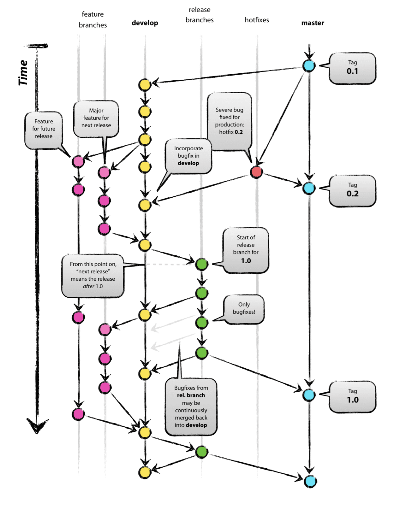

# pikka_FrontServer
프론트엔드 서버

## Front-서버 테스트

* 은진 : pikkacu
    * 파일생성 및 pikka 컴포넌트 import
    * Readme 작성
* 승엽
    * 관리자 페이지 헤더 & 사이드 바 (2024.07.22)
    * 관리자 페이지 병합 (2024.07.24)
* 정한
    * 문의사항 생성 및 작성
    * 로그인 페이지 html 생성 및 router
* 재석
    *공지사항 생성 및 app.vue import
    * Readme 작성
    * 게시판 crud 생성
* 은성
    

## Git-flow 전략
pikka-coding 이 선택한 깃 전략은 Git-flow 전략 입니다.  
우아한 형제들 기술블로그를 참고했습니다.

* main: 배포가 완료되거나 배포가 확정된 브랜치
* releasbranch : 배포를 앞둔 브랜치
* develop : 배포를 위해 개발중인 프랜치

출처 : https://techblog.woowahan.com/2553/

